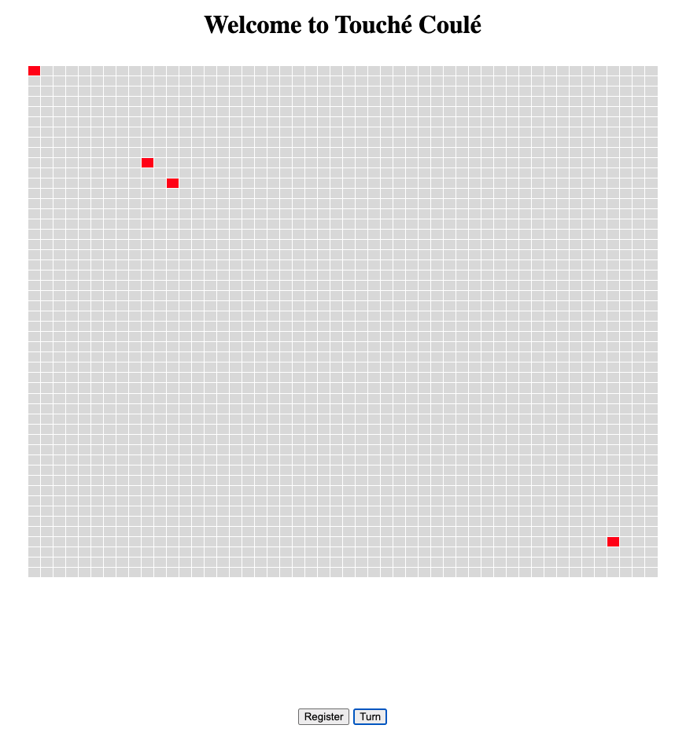

# README

## Interface de jeu

---

## Contexte de jeu

Nous avons créé 4 sous-contrats hérités du contrat `***Ship.sol***` pour représenter les quatre bateaux des deux joueurs. Lorsque nous cliquons sur le bouton `**Register**`, la page passe automatiquement à l'interface de transaction de `**Metamask**`, cliquons sur le bouton `**Confirm**` pour confirmer la transaction et la page passe au panneau de jeu. Un point rouge apparaît sur le panneau pour indiquer qu'un nouveau bateau a été créé par l'utilisateur actuel du `**Metamask**`. Si le joueur tente de créer un bateau en utilisant une adresse de contrat qui a déjà été enregistrée, l'erreur `"*Ship already on the board*"` va apparaître . Si le même joueur continue à cliquer sur le bouton `**Register**`, un nouveau bateau continuera à être enregistré sur le compte actuel. Si le même joueur tente de s'inscrire une troisième fois, l'erreur `"*Only two ships*"` s'affichera. Dans ce cas, vous pouvez changer de compte `**Metamask**` pour permettre à un deuxième joueur de se rejoindre le jeu. Le deuxième joueur peut ensuite créer ses deux propres bateaux de la même manière.

Une fois que les deux joueurs ont créé un total de quatre bateaux, ils peuvent commencer à s'attaquer mutuellement. En cliquant sur le bouton `**Turn**`, chacun des quatre bateaux va attaquer au hasard en utilisant la fonction `***fire()***` du contrat `***Ship.sol***`  (en choisissant au hasard une grille sur le panneau comme cible). Si un bateau est touché, il disparaît depuis panneau.

---

## Fichiers Modifiés

`*App.tsx*`: Modification de l'effet d'action `***onClick()***` du bouton `**Register**`

`*main.ts*`

`*000001-deploy-game.ts*`

---

## Fichiers Ajoutés

`*InstanceShip.sol*`

`*InstanceShipSec.sol*`

`*InstanceShipThird.sol*`

`*InstanceShipFourth.sol*`

---

## Remarque

Si vous voulez tester notre programme, vous devrez réinitialiser l'utilisateur (compte metamask) qui participe au jeu avant le début de la partie, sinon une erreur pourrait être signalée pendant la partie suivante.