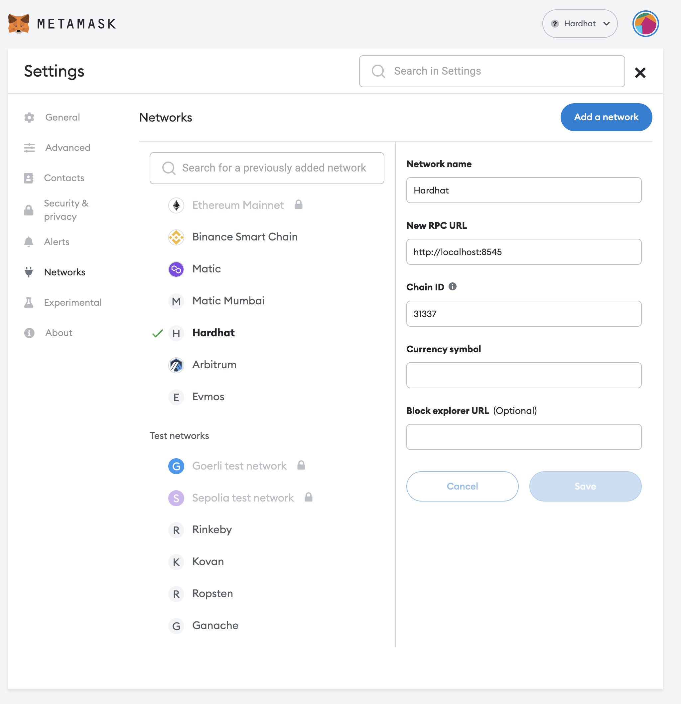

# Touché Coulé

Welcome to the DAAR project. The idea will be to implement a "Touché Coulé" (Battleship) game
in a decentralized way, on Ethereum. This will have cool side effects, like not
be forced to pay for servers.

# Installation

```bash
# With HTTPS
git clone https://github.com/ghivert/touche-coule.git
# Or with SSH
git clone git@github.com:ghivert/touche-coule.git
```

You’ll need to install dependencies. You’ll need [`HardHat`](https://hardhat.org/), [`Node.js`](https://nodejs.org/en/), [`NPM`](https://www.npmjs.com/) and [`Yarn`](https://yarnpkg.com/). You’ll need to install [`Metamask`](https://metamask.io/) as well to communicate with your blockchain.

- `HardHat` is a local blockchain development, to iterate quickly and avoiding wasting Ether during development. Fortunately, you have nothing to do to install it.
- `Node.js` is used to build the frontend and running `truffle`, which is a utility to deploy contracts.
- `NPM` or `Yarn` is a package manager, to install dependencies for your frontend development. Yarn is recommended.
- `Metamask` is a in-browser utility to interact with decentralized applications.

# Some setup

Once everything is installed, launch the project (with `yarn dev`). You should have a local blockchain running in local. Open Metamask, setup it, and add an account from the Private Keys HardHat displays.
Now you can connect Metamask to the blockchain. To do this, add a network by clicking on `Ethereum Mainnet` and `personalized RPC`. Here, you should be able to add a network.



Once you have done it, you’re connected to the HardHat blockchain!

# Installation

Install the dependencies.

```bash
# Yarn users
yarn
```

Run the complete project.

```bash
# Yarn users
yarn dev
```

You’re good to go!

# Subject

Implement a Touché Coulé from scratch in Solidity. The game is running into a contract by its own. Your job is to create an agent (i.e. a smart contract, i.e. an AI) to play the game. The interface of the agent is given in the sources.

The idea of the game is to fight in a free for all style (every players will play in the same time) with ships. Each player have two ships, of size 1. At the beginning of the game, you're placing your ships on a grid (50x50). Every turn, your ships will be able to fire once. Your goal is to destroy all the opponents ships. In a second step, your ships will be able to talk to each other, and potentially to do some diplomacy with other ships.

# Smart Contract

- Create your ship by inheriting the base contract.
- The contract should override all the functions in the `Ship.sol` contract.
- `place` is the first function called by the contract after registering the ship. It should returns the place of the ship.
- `update` is called after the ship is placed on the board. For some implementation reasons, the place can, in some times, not be given. You can use that information, or not.
- Finally, `fire` is run at each turn, and should try to touch a ship by returning a position (x, y).
- Deploy the contract with a proper deployment. 
- Register the ship on the Main contract. 
- Do all the same steps with a second ship and a second player. 
- Test your implementation with the turn function. 

Pro tip: you can automate the ship deployment and registering with the deployments. 
